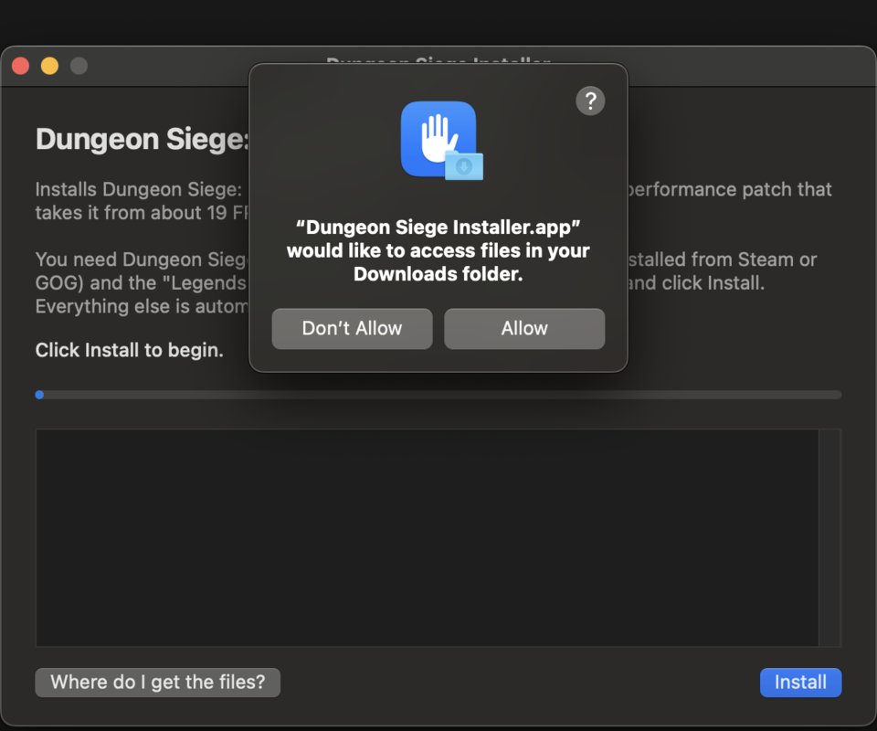
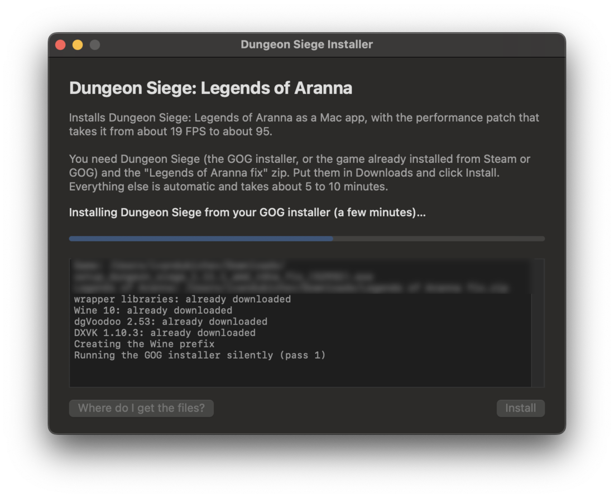
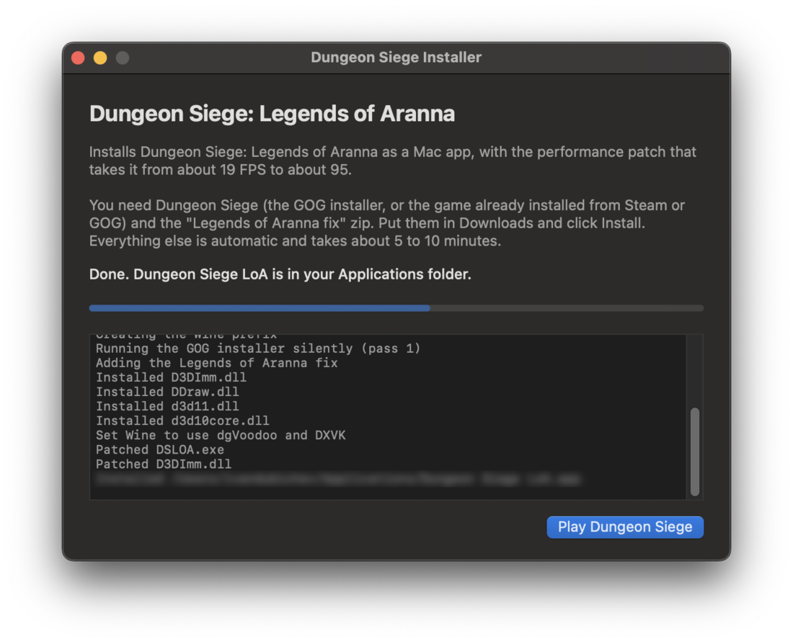
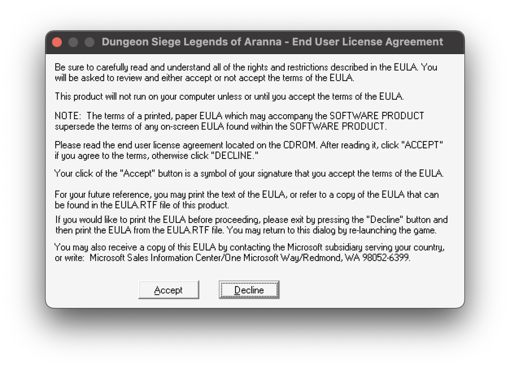
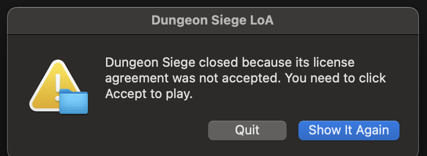

# Install (Mac)

Three steps and about 10 minutes. You won't need Terminal.

**You need:**

- A Mac with Apple Silicon (M1 or newer)
- **Dungeon Siege** from [GOG](https://www.gog.com/en/game/dungeon_siege_collection) or Steam
- The **Legends of Aranna fix**, a free community download. GOG and Steam only sell the base game, and this adds the expansion.
- About 4 GB of free space

## 1. Put the game files in Downloads

- **GOG:** in your GOG library, open Dungeon Siege, pick **Download offline backup game installers**, and grab both parts: `setup_dungeon_siege_1.11.1_….exe` and the `.bin` file next to it.
- **Steam:** copy the `Dungeon Siege 1` folder from a Windows PC (`Steam\steamapps\common\Dungeon Siege 1`). Already have it on this Mac in CrossOver or Whisky? Skip this, the installer finds it.
- **Legends of Aranna fix:** download `Legends of Aranna fix.zip` from one of the links in the [GenesisFR guide](https://gist.github.com/GenesisFR/f3df7f092db17dd63d85eb1f19da7153#-links-).

Leave the zip zipped. The installer reads it as is.

## 2. Download the installer

Get **[Dungeon Siege Installer](https://github.com/idubichev/dungeon-siege-loa-optimizations/releases/latest/download/Dungeon-Siege-Installer.zip)** and double-click the zip to unzip it.

macOS blocks it the first time because it isn't from the App Store. Click **Done**, open **System Settings → Privacy & Security**, scroll down, and click **Open Anyway** next to "Dungeon Siege Installer". You only do this once.

## 3. Click Install

<p align="center"></p>

Open the installer and click **Install**. macOS asks if it can look in your Downloads folder. Click **Allow**, that's how it finds the files from step 1.

<p align="center"></p>

Now wait. The installer downloads Wine and the graphics translators (about 270 MB), installs the game, and adds Legends of Aranna and the patch. The box at the bottom shows what it's doing.

<p align="center"></p>

When it says **Done**, click **Play Dungeon Siege**. From now on you open it like any other app: **Dungeon Siege LoA** in your Applications folder.

<p align="center"></p>

If Rosetta isn't installed yet, the installer asks to install it first and you type your Mac password once.

## First launch

The game shows Microsoft's license agreement the first time. Click **Accept**.

<p align="center"></p>

Clicked Decline by mistake? The game closes and the app offers to show it again.

<p align="center"></p>

## Good to know

- **Saves** live inside `Dungeon Siege LoA.app`. Deleting the app deletes them, so back up first: right-click the app, **Show Package Contents**, and copy `Contents/SharedSupport/prefix/drive_c/users`.
- **Frame-rate counter:** open the app's package contents, go to `Contents/SharedSupport/prefix/drive_c/GOG Games/Dungeon Siege`, open `dxvk.conf`, and remove the `#` in front of `dxvk.hud = fps`.
- **Uninstall:** drag `Dungeon Siege LoA` from Applications to the Trash. Nothing else is installed anywhere.

## If something goes wrong

| What you see | What to do |
|---|---|
| The installer seems stuck right after clicking Install | macOS is waiting for you to answer "allow access to Downloads". Look for that prompt and click **Allow**. |
| "One more download: Legends of Aranna" | The fix zip isn't in Downloads. Click **Open Download Page**, download it, and click Install again. |
| "That zip doesn't contain DSLOA.exe" | You picked a different zip. Use `Legends of Aranna fix.zip` from the GenesisFR guide. |
| "The GOG installer didn't finish" | The `.bin` file must be in the same folder as the GOG `.exe`. |
| "Installed without the patch" | Your `DSLOA.exe` isn't the one the patch was made for, usually because another mod changed it. The game works at normal speed. |
| Anything else | [Open an issue](https://github.com/idubichev/dungeon-siege-loa-optimizations/issues) and paste the text from the installer's log box. |

## Advanced

### Already have the game in a Wine wrapper?

If you play in a Sikarugir, Wineskin or CrossOver setup you built yourself, you can patch that copy in place instead:

1. Download this repository (**Code → Download ZIP**) and unzip it.
2. Quit the game, then double-click **`Install.command`**. It finds the game, adds dgVoodoo 2.53 and DXVK, sets the Wine DLL settings, backs up your originals and patches them.
3. **`Uninstall.command`** puts the originals back.

The wrapper needs the Legends of Aranna fix already installed. macOS may block the `.command` file the first time; allow it under **System Settings → Privacy & Security → Open Anyway**.

### Patch an existing wrapper from Terminal

`Install.command` runs one Terminal command. You can run it yourself instead.

#### What a path is

A **path** is a file or folder's full address on your Mac: the folders you'd click through, separated by `/`.

- `~` means your home folder. `~/Downloads` and `/Users/alex/Downloads` are the same place.
- Folder names with spaces must be wrapped in quotes, like `"Dungeon Siege"`, or Terminal reads them as two separate words.
- `alex` in these examples is **your** Mac username. Terminal's prompt starts with it, as in `alex@Alexs-MacBook ~ %`.

#### The two paths

**The patcher**, inside the folder you unzipped:

```
/Users/alex/Downloads/dungeon-siege-loa-optimizations-main/patch.py
```

**The game folder**, the one that contains `DSLOA.exe`. For a wrapper named `Dungeon Siege` in Sikarugir's default location:

```
/Users/alex/Applications/Sikarugir/Dungeon Siege.app/Contents/SharedSupport/prefix/drive_c/GOG Games/Dungeon Siege
```

That looks long because a wrapper is really a folder pretending to be an app. Windows thinks the game lives at `C:\GOG Games\Dungeon Siege`; on your Mac, Windows' `C:` drive is the `drive_c` folder inside the wrapper.

#### The command

Paste this into Terminal, change `alex` to your username in both places, and press Return:

```sh
python3 "/Users/alex/Downloads/dungeon-siege-loa-optimizations-main/patch.py" "/Users/alex/Applications/Sikarugir/Dungeon Siege.app/Contents/SharedSupport/prefix/drive_c/GOG Games/Dungeon Siege" --install-renderer --install-dxvk
```

Or skip the username with `~`. The quotes start *after* `~/`, because `~` only works outside quotes:

```sh
python3 ~/"Downloads/dungeon-siege-loa-optimizations-main/patch.py" ~/"Applications/Sikarugir/Dungeon Siege.app/Contents/SharedSupport/prefix/drive_c/GOG Games/Dungeon Siege" --install-renderer --install-dxvk
```

Leave the game folder out entirely and the patcher searches for it, just like `Install.command`.

#### Drag and drop instead of typing

Terminal types a path for you when you drag something into its window:

1. Type `python3` and a space. Don't press Return.
2. Drag `patch.py` into the Terminal window, then type a space.
3. Drag your **Dungeon Siege** folder into the window (right-click the wrapper app, **Show Package Contents**, then `Contents`, `SharedSupport`, `prefix`, `drive_c`, `GOG Games`).
4. Type a space, then `--install-renderer --install-dxvk`, and press Return.

Dragged paths put a backslash before each space (`Dungeon\ Siege`) instead of using quotes. Both mean the same thing.

#### Other options

Swap the ending of the command:

| Ending | What it does |
|---|---|
| `--status` | Shows whether each file is original or patched |
| `--restore` | Puts every original file back (what `Uninstall.command` runs) |

#### What the installer changes

- Downloads `DDraw.dll` and `D3DImm.dll` from dgVoodoo 2.53, and `d3d11.dll` and `d3d10core.dll` from DXVK-macOS 1.10.3, into the game folder. Every file's SHA-256 is checked.
- Writes [`config/dxvk.conf`](config/dxvk.conf) next to them (120 FPS cap).
- Adds five DLL overrides (`ddraw`, `d3dim`, `d3d8`, `d3d11`, `d3d10core` set to *native, builtin*) to the wrapper's Wine registry, `user.reg`, keeping a copy as `user.reg.dspatch-backup`. This is the same as adding them by hand in `winecfg` → Libraries.
- Patches `DSLOA.exe` and `D3DImm.dll`, after copying the originals into a `dspatch-backup` folder inside the game folder.

## Tested setup

M4 MacBook Pro, macOS 15. The installer builds the game with Wine 10.0 (Sikarugir build, revision 3), Sikarugir wrapper libraries 1.0.20, dgVoodoo 2.53 and DXVK-macOS 1.10.3-20230507, on GOG Dungeon Siege 1.11.1 (build 52932) plus the Legends of Aranna fix. Tested paths: GOG installer plus fix zip, and a copied base-game folder plus fix zip.
