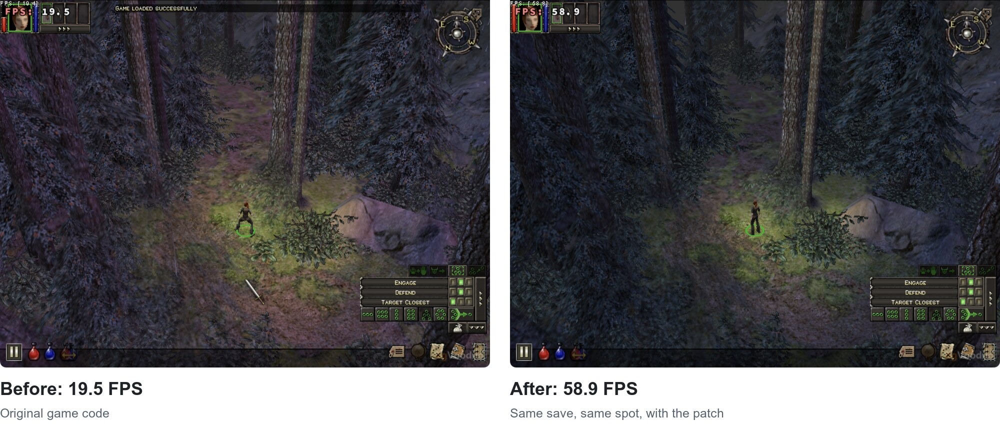
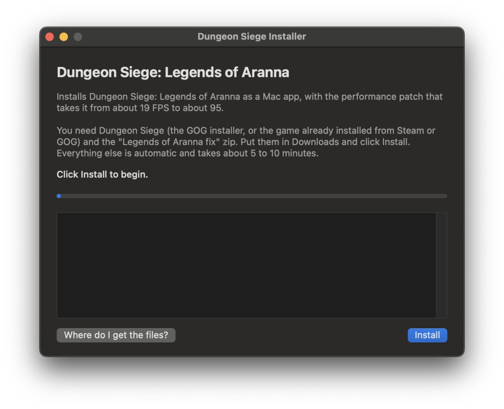
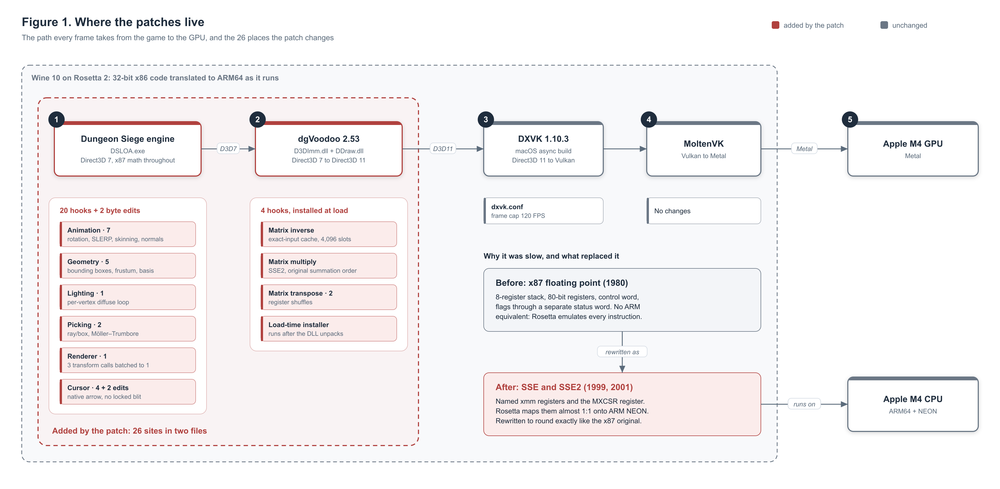
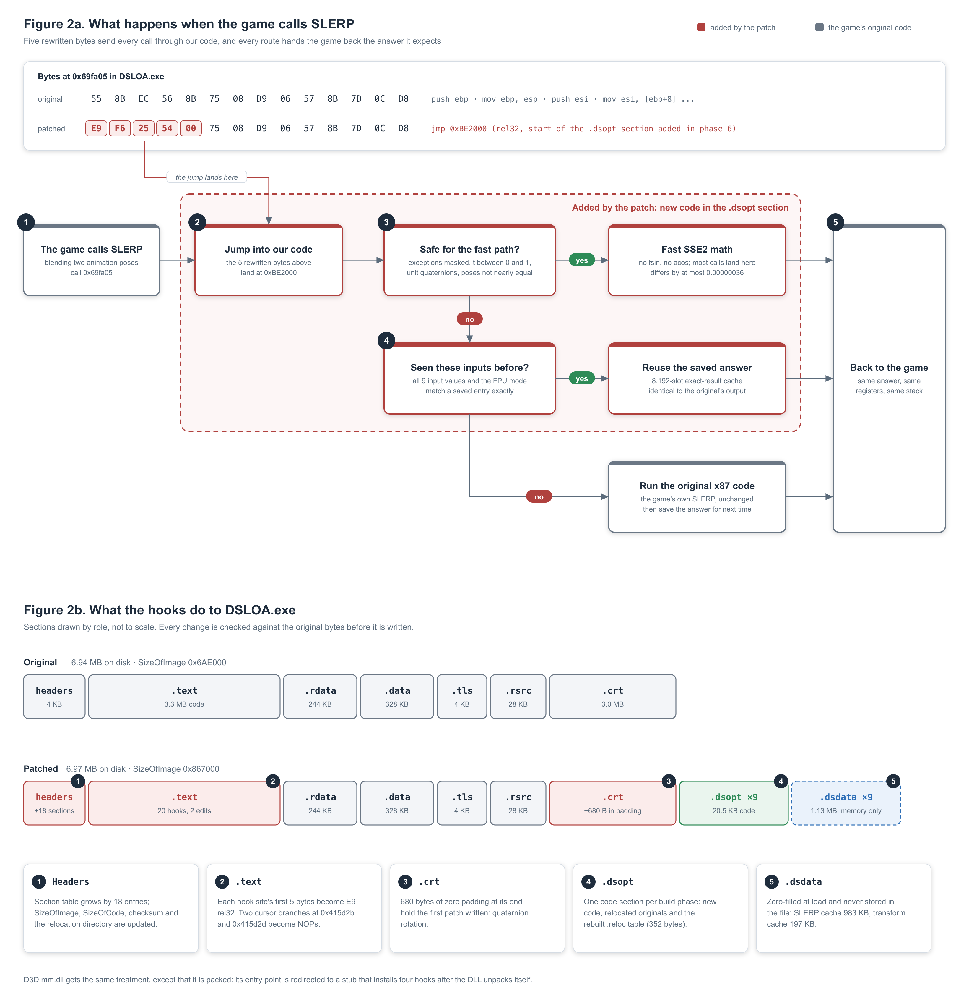
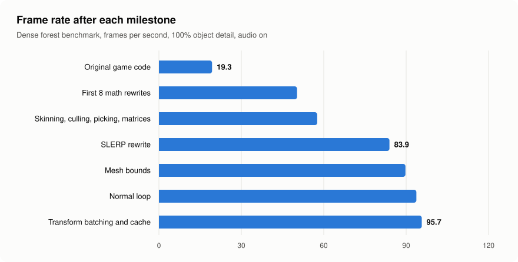

<p align="center">
  
</p>

# Dungeon Siege, three times faster on your Mac

Dungeon Siege: Legends of Aranna runs at about 19 FPS on Apple Silicon Macs. This patch triples that with object detail maxed out, and fixes the mouse stutter while it's at it. The pictures above are the same save, the same spot, on an M4 MacBook Pro.

[Download the installer](https://github.com/idubichev/dungeon-siege-loa-optimizations/releases/latest/download/Dungeon-Siege-Installer.zip) · [Install guide](INSTALL.md) · [How it works](#how-it-works)

## Installing

You'll need Dungeon Siege from [GOG](https://www.gog.com/en/game/dungeon_siege_collection) (or Steam, copied over from a PC) and the community [Legends of Aranna fix](https://gist.github.com/GenesisFR/f3df7f092db17dd63d85eb1f19da7153#-links-), since neither store sells the expansion. Put both in your Downloads folder, then:

1. Download the installer and open it.
2. Click Install. macOS will ask whether it can look in your Downloads folder; click Allow.
3. Wait 5 to 10 minutes, then click Play.

<p align="center"></p>

It builds a standalone "Dungeon Siege LoA" app in your Applications folder with its own copy of Wine, so there's nothing else to set up. To uninstall, drag that app to the Trash. Your saves live inside it, so copy them out first if you want to keep them.

The first time you open the installer, macOS will block it because it isn't from the App Store. Go to System Settings → Privacy & Security and click Open Anyway. [INSTALL.md](INSTALL.md) has the full walkthrough and a troubleshooting table.

## FAQ

Does it change the game? No. The rewritten code gives the same results as the original down to the last bit, except one animation-blending routine that can differ by less than a millionth. Your saves and settings aren't touched.

Is it safe? Every download and every patched file is checked against a SHA-256 hash, and all the source is in this repo. No game files are included; the patch is applied to your own copy.

Why do I need the Legends of Aranna fix? GOG and Steam only sell the base game. The expansion comes from that community pack, and the patch is built for its `DSLOA.exe`.

What about Windows? It would work, but there's little to gain. The slowdown comes from how Macs translate the game's old x87 math, which Windows PCs run natively.

Already running the game in your own Wine wrapper? Use `Install.command` to patch it in place. See [INSTALL.md](INSTALL.md#advanced).

Something broke? [Open an issue](https://github.com/idubichev/dungeon-siege-loa-optimizations/issues) and paste the installer's log.

---

# How it works

Dungeon Siege: Legends of Aranna does almost all of its 3D math on the CPU, using the x87 floating-point unit Intel designed in 1980. On an Apple Silicon Mac that code runs through Rosetta 2, which has no hardware to map x87 onto and has to emulate it in software. In a dense forest, on an M4 MacBook Pro, the game ran at 19 frames per second.

We found the hot routines with sampling profilers and Ghidra, rewrote 20 of them in SSE/SSE2 assembly and C, and spliced the new code directly into the shipped executable and renderer DLL. The replacements reproduce the original results bit for bit, with one deliberate and measured exception. The benchmark now averages 95 FPS at 100% object detail, and lighter scenes run at the 120 FPS frame cap.

| 19 → 95 FPS | 20 | 26 | 2.2 million |
|:---:|:---:|:---:|:---:|
| dense forest benchmark | math routines rewritten | patch sites across two binaries | test cases run against the original code |


### Highlights

- A quaternion rotation that took 56 emulated x87 instructions, rewritten as straight-line SSE that rounds identically in both precision modes the game uses.
- Animation blending (SLERP) re-derived from a half-angle identity and two power series. It removes three `fsin` instructions and an `acos` call from every blend, and on its own took the benchmark from 57.6 to 83.9 FPS.
- Direct3D 7 transform calls batched at the COM boundary, behind a content-addressed matrix cache with a 97% hit rate.
- A 119 ms stutter traced to the mouse cursor thread holding the renderer lock during a software blit, and removed.
- All of it delivered by PE surgery: two new sections, a rebuilt relocation table, a recomputed checksum, and a load-time patcher for a packed DLL.

<details>
<summary><b>New to assembly or 3D math? Start here.</b></summary>

<br>

**Machine code and assembly.** A CPU runs numbers. Each instruction is a few bytes: `E9` followed by four more bytes means "jump to another place in the program". A game's `.exe` is millions of these bytes. Assembly is the readable form of the same instructions (`jmp 0x69fa05` instead of `E9 xx xx xx xx`). Without source code, assembly is what you work with.

**Addresses.** Every instruction lives at a numbered location in memory, written in hexadecimal. "The function at `0x535f3b`" means the code that starts at that location inside the running game.

**Floating point.** Computers store decimals as floating-point numbers. A 32-bit `float` holds about 7 significant digits and a 64-bit `double` about 16. Every operation rounds its result to fit, which is why `0.1 + 0.2` isn't exactly `0.3` on a computer.

**x87 and SSE.** x86 processors have two separate ways to do floating-point math. x87 dates from 1980 and works like a stack calculator: push numbers (`fld`), operate on the top of the stack (`fmul`, `fadd`), pop the result (`fstp`). A control word decides how precisely it rounds. SSE (1999) and SSE2 (2001) replaced it with ordinary named registers (`xmm0` to `xmm7`) and a separate settings register called MXCSR.

**Rosetta 2 and Wine.** Apple Silicon runs ARM machine code, not x86. Rosetta 2 translates x86 instructions into ARM instructions as a program runs. Wine implements the Windows API on macOS, so a Windows game can run without Windows.

**3D math vocabulary.** A vector is three numbers `(x, y, z)`, a position or a direction. The dot product `a·b` measures how much two directions agree. The cross product `a × b` gives a direction perpendicular to both. A matrix is a 4×4 grid of numbers that moves, rotates or scales points when you multiply by it. A quaternion is four numbers `(x, y, z, w)` that encode a rotation; games use them for skeletons because they blend smoothly and never lock up the way stacked angles can.

</details>

## Why a 2002 game ran at 19 FPS on a 2024 laptop

<p align="center"></p>

The game talks to Direct3D 7, a graphics API from 1999. To reach the GPU on a Mac, its calls pass through four translation layers: dgVoodoo turns Direct3D 7 into Direct3D 11, DXVK turns that into Vulkan, MoltenVK turns Vulkan into Metal, and all of it runs inside Wine. That chain was the obvious suspect, so we tried replacing parts of it first: DXMT (Direct3D 11 straight to Metal), newer DXVK forks, Wine 11. None of them moved the frame rate in a meaningful way. The bottleneck was on the CPU.

Rosetta translates SSE almost one-to-one onto ARM's NEON vector unit. x87 has no ARM counterpart. It has an eight-register stack whose top moves with every push and pop, 80-bit internal registers, a control word that sets precision and rounding, and comparisons that report through a separate status word. Rosetta emulates all of that in software, so a run of `fld`, `fmul` and `fstp` costs many native instructions, and `fsin` costs far more.

Dungeon Siege was compiled for x87 throughout. Sampling the main thread showed most of the frame going to a small set of math functions and tight loops: bone rotation, animation blending, skinning, bounding boxes, culling, lighting and mouse picking. Those became the targets.

## How the patches get into the game

<p align="center"></p>

With no source to recompile, the changes go straight into the binary. We add a section to the executable to hold our code, then overwrite the first five bytes of each slow function with a jump into it. Our code checks whether it can handle the call. If it can, it runs the SSE version and returns to the caller. If it can't, it runs a relocated copy of the original function, so the game never reaches a code path we haven't accounted for.

The build tooling is the `PE` class in [`build-static-patches.py`](https://github.com/idubichev/dungeon-siege-loa-optimizations/blob/lab-archive/lab/phase2/build-static-patches.py) and the per-phase builders that extend it, preserved at the `lab-archive` tag. The finished binaries are captured exactly by the BPS files in [`patches/`](patches).

**Two new sections.** A Windows executable is a PE (Portable Executable) file divided into sections. We append two:

| Section | Characteristics | Contents |
|---|---|---|
| `.dsopt` | `0x60000020`: code, readable, executable | New code, relocated copies of the original functions, the rebuilt relocation table |
| `.dsdata` | `0xC0000080`: uninitialized data, read/write | Cache storage, zero-filled by the loader |

`SizeOfImage`, `SizeOfCode`, `SizeOfUninitializedData` and the section count are updated, and the image checksum is recomputed. The base relocation directory moves to the end of `.dsopt` and gains an entry for every absolute address in the new code. Windows uses that table to fix up addresses if it loads the image somewhere other than its preferred base.

**Hooks.** Each hook writes `E9 rel32` (a relative jump) over the first five bytes of its target. The builder first asserts that the bytes it is about to overwrite are exactly the ones it expects, so it will never patch a different build of the game. The fallback takes one of two forms:

- A full copy of the original function placed after the new code. Capstone disassembles the copy to find its absolute memory operands, and each one is added to the relocation table.
- A trampoline: the overwritten prologue bytes followed by a jump back into the original function just past the hook.

**Compiled patches.** The C and C++ patches are built with:

```
clang -target i686-w64-windows-gnu -O2 -msse2 -mfpmath=sse \
      -ffp-contract=off -fno-vectorize -fno-slp-vectorize -ffreestanding
```

A small COFF linker of our own ([`coff-reference.py`](https://github.com/idubichev/dungeon-siege-loa-optimizations/blob/lab-archive/lab/phase4/coff-reference.py)) places the object code into `.dsopt` and resolves its symbols to game addresses. `-ffp-contract=off` stops the compiler from fusing a multiply and an add into one instruction, which would round differently from the original.

**The packed DLL.** dgVoodoo's `D3DImm.dll` ships compressed and only unpacks itself in memory, so there is no code on disk to patch. Instead we point its PE entry point at a stub, [`renderer_init`](src/renderer/dgvoodoo/load-time-hooks.c). The stub calls the real `DllMain`, which unpacks the image. Then, for each hook site, it verifies the five-byte prologue, makes the page writable with `VirtualProtect`, writes the jump, restores the protection and calls `FlushInstructionCache` so the CPU doesn't run a stale copy.

The finished build has 20 hooks and 2 byte-level edits in `DSLOA.exe`, plus 4 hooks installed at load time in `D3DImm.dll`.

## Matching x87 bit for bit

Close isn't good enough. In a game engine small float differences compound: a character ends up a pixel off, a click lands on a different object, a scripted sequence plays out differently. So the target was the original's exact output, and that means reproducing three things x87 does implicitly.

**Precision.** Bits 8 and 9 of the x87 control word (the PC field) decide how every intermediate result is rounded:

| `CW & 0x300` | x87 rounds to | Matching SSE code |
|---|---|---|
| `0x000` | 24-bit mantissa (float) | `mulss` / `addss` |
| `0x200` | 53-bit mantissa (double) | `mulsd` / `addsd`, then `cvtsd2ss` on store |
| `0x300` | 64-bit mantissa (extended) | no SSE equivalent; the original code runs |

The game's main thread runs in 24-bit mode with audio disabled. Enabling in-game audio switches it to 53-bit mode. Our first patches only handled one mode, so with sound on they quietly fell back to the slow path on every call. The shipped versions carry both.

**Rounding direction.** x87 and SSE each keep their own rounding mode, in different bit positions. Every patch copies the x87 mode into MXCSR on entry and restores the caller's MXCSR on exit:

```asm
fnstcw  (%esp)                 ; x87 control word
stmxcsr 4(%esp)                ; caller's MXCSR
movzwl  (%esp), %eax
shll    $3, %eax
andl    $0x6000, %eax          ; x87 RC (bits 10-11) to MXCSR RC (bits 13-14)
movl    4(%esp), %edx
andl    $0xffff1fbf, %edx      ; clear RC, DAZ (bit 6) and FZ (bit 15)
orl     %eax, %edx
movl    %edx, 8(%esp)
ldmxcsr 8(%esp)
...
ldmxcsr 4(%esp)                ; restore on exit
```

DAZ and FZ flush tiny values to zero, which x87 never does, so both are cleared. Every patch also requires `(CW & 0x3F) == 0x3F` (all x87 exceptions masked) and otherwise runs the original.

**Exponent range.** Even in 53-bit mode, x87 registers keep a 15-bit exponent, so values that would overflow or go subnormal in a true `double` survive on x87. Patches exposed to that reject any input above 10¹⁰ (`(bits & 0x7fffffff) > 0x501502f9`), plus NaN and infinity, and hand those calls to the original.

On top of that, every replacement keeps the original's order of operations. If the compiled game sums a dot product as `(x·x' + z·z') + y·y'`, so does the patch.

Each patch was checked by loading the extracted original routine and the replacement into a 32-bit Python process under Wine and running both on the same inputs: random values, random bit patterns, NaN, infinity, signed zeros, subnormals and overlapping pointers, across every precision and rounding mode. The harnesses are in [`tests/harness`](tests/harness) and their results in [`tests/results`](tests/results).

## The patches

Ordered roughly by impact. Addresses are virtual addresses in `DSLOA.exe` (image base `0x400000`) unless noted. The function names are ours; the game ships without symbols.

### SLERP: animation blending without trigonometry

<sub>`0x69fa05` · [`slerp-fast.c`](src/animation/slerp-fast.c), [`slerp-cache.c`](src/animation/slerp-cache.c) · benchmark 57.6 → 83.9 FPS</sub>

Characters animate by blending between stored key poses. Each bone's orientation is a quaternion, and the right way to blend two of them is spherical linear interpolation: turn at constant speed along the shortest arc between the two orientations. The textbook formula needs an inverse cosine and three sines, and the engine evaluates it constantly while characters move.

```
θ    = acos(|q0·q1|)
q(t) = q0 · sin((1−t)θ) / sin θ  ±  q1 · sin(tθ) / sin θ
```

The sign flips when `q0·q1 < 0`, so the blend takes the short way round. The original computes this with three `fsin` instructions and a call to an `acos` helper, and branches on comparisons through the x87 status word:

<details>
<summary>Original x87 (excerpt)</summary>

```asm
0069fa0c  d9 06              fld   dword ptr [esi]          ; q0.x
0069fa12  d8 0f              fmul  dword ptr [edi]          ; · q1.x
...                                                         ; + w, z, y terms: d = q0·q1
0069fa2c  d8 15 e8 a5 72 00  fcom  dword ptr [0x72a5e8]     ; compare d with 0.0
0069fa32  df e0              fnstsw ax                      ; x87 condition bits into ax
0069fa34  f6 c4 05           test  ah, 5
0069fa37  7a 5a              jp    0x69fa93                 ; d ≥ 0: other branch
0069fa39  d9 e0              fchs                           ; d = −d
0069fa3b  dd 05 00 a7 72 00  fld   qword ptr [0x72a700]     ; 1.0
0069fa41  d8 e1              fsub  st(1)                    ; 1 − d
0069fa43  dc 1d f8 a6 72 00  fcomp qword ptr [0x72a6f8]     ; 1 − d < 0.001?
0069fa49  df e0              fnstsw ax
0069fa4b  f6 c4 05           test  ah, 5
0069fa4e  7a 0c              jp    0x69fa5c                 ; no: full SLERP
...                                                         ; yes: linear blend
0069fa5c  51                 push  ecx
0069fa5d  d9 1c 24           fstp  dword ptr [esp]
0069fa60  e8 9b b4 d7 ff     call  0x41af00                 ; θ = acos(d)
0069fa65  d9 55 0c           fst   dword ptr [ebp+0xc]
0069fa69  d9 c0              fld   st(0)
0069fa6b  d9 fe              fsin                           ; sin θ
0069fa6d  d8 3d f0 a6 72 00  fdivr dword ptr [0x72a6f0]     ; 1 / sin θ
0069fa73  d9 5d 08           fstp  dword ptr [ebp+8]
0069fa76  d9 e8              fld1
0069fa78  d8 65 10           fsub  dword ptr [ebp+0x10]     ; 1 − t
0069fa7b  d8 c9              fmul  st(1)                    ; (1 − t)θ
0069fa7d  d9 fe              fsin                           ; sin((1 − t)θ)
...
0069fa87  d8 4d 10           fmul  dword ptr [ebp+0x10]     ; tθ
0069fa8a  d9 fe              fsin                           ; sin(tθ)
```

`fnstsw ax` / `test ah, 5` / `jp` is how x87 code branches: the FPU can't set the CPU's flags directly, so it copies its own condition bits (C0, C2, C3) into `ax` and the code tests those.

</details>

The replacement avoids every transcendental instruction. With `d = |q0·q1|`:

- **The angle, without `acos`.** For unit quaternions `|q0 − q1|² = 2 − 2d`, so `sin(θ/2) = √((1−d)/2)` and `θ = 2·asin(√((1−d)/2))`. The argument to `asin` never exceeds `√½`, where the Maclaurin series `asin x = Σ (2n)! / (4ⁿ (n!)² (2n+1)) · x^(2n+1)` converges quickly. Twenty-four terms leave a truncation error below 2×10⁻¹⁰ radians.
- **sin θ, without `sin`.** `d` is `cos θ`, so `sin θ = √(1 − d²)`: one `sqrtsd`.
- **The two weights.** `sin((1−t)θ)` and `sin(tθ)` use the odd Taylor polynomial through x¹⁷, evaluated in Horner form. With `θ ≤ π/2` its error sits far below float resolution.

The fast path runs only on well-conditioned input: exceptions masked, `0 ≤ t ≤ 1`, distinct buffers, both `|q|²` within 0.98 to 1.02, and `d < 0.9989`. The last condition matters because as two poses converge, `sin θ` approaches zero and dividing by it amplifies error. Everything else falls through.

Behind the fast path sits an exact-result cache, installed with a 7-byte trampoline. Its key is the nine input words plus the x87 control word, hashed with FNV-1a and a murmur3 finalizer into 8,192 slots of 60 bytes each in `.dsdata`. A `cmpxchg` spinlock guards it; a call that finds the lock taken skips the cache instead of waiting. NaN and infinity bypass it.

This is the one patch that does not reproduce the original bit for bit. Across 140,000 test cases the largest difference in any quaternion component was 3.6×10⁻⁷, far below anything visible on screen.

A second SLERP entry at `0x41adf4` (four arguments, separate output buffer) gets the same exact cache ([`slerp2-cache.c`](src/animation/slerp2-cache.c)) through a 6-byte trampoline, and bypasses it when the output overlaps either input.

### Bone rotation: 56 x87 instructions, rewritten

<sub>`0x535f3b` · [`quat-rotate.s`](src/animation/quat-rotate.s) · part of the first round, which took the benchmark from 19.3 to 50.3 FPS</sub>

Every animated vertex, and every surface normal, is rotated by its bone's quaternion each frame. The function that does it is tiny and runs constantly.

It is a `thiscall`: `ecx` holds the quaternion `(x, y, z, w)`, the stack holds `(vec3* out, const vec3* in)`, and it returns with `ret 8`. With `u = (x, y, z)`:

```
v' = (2w² − 1)·v + 2(u·v)·u + 2w·(u × v)
```

The original spends 56 x87 instructions on it, including the stack shuffles (`fld st(2)`, `fstp st(0)`) that Rosetta has to model by tracking the moving top of stack. The SSE version computes `2w`, `2w² − 1` and `2(u·v)` once into `xmm4` to `xmm6`, then builds each output component from those, in the original order.

<details>
<summary>Original x87 and SSE replacement, first output component</summary>

```asm
; original
00535f3b  d9 41 0c           fld   dword ptr [ecx+0xc]     ; w
00535f3e  8b 44 24 08        mov   eax, [esp+8]            ; eax = in
00535f42  dc c0              fadd  st(0), st(0)            ; 2w
00535f44  8b 54 24 04        mov   edx, [esp+4]            ; edx = out
00535f48  d9 c0              fld   st(0)
00535f4a  d8 49 0c           fmul  dword ptr [ecx+0xc]     ; 2w·w
00535f4d  d8 25 f0 a6 72 00  fsub  dword ptr [0x72a6f0]    ; 2w² − 1.0
00535f53  d9 40 08           fld   dword ptr [eax+8]
00535f56  d8 49 08           fmul  dword ptr [ecx+8]       ; v.z·u.z
00535f59  d9 40 04           fld   dword ptr [eax+4]
00535f5c  d8 49 04           fmul  dword ptr [ecx+4]       ; v.y·u.y
00535f5f  de c1              faddp st(1)
00535f61  d9 00              fld   dword ptr [eax]
00535f63  d8 09              fmul  dword ptr [ecx]         ; v.x·u.x
00535f65  de c1              faddp st(1)                   ; u·v, summed z, y, x
00535f67  dc c0              fadd  st(0), st(0)            ; 2(u·v)
00535f69  d9 40 08           fld   dword ptr [eax+8]
00535f6c  d8 49 04           fmul  dword ptr [ecx+4]       ; v.z·u.y
00535f6f  d9 40 04           fld   dword ptr [eax+4]
00535f72  d8 49 08           fmul  dword ptr [ecx+8]       ; v.y·u.z
00535f75  de e9              fsubp st(1)                   ; (u × v).x
00535f77  d8 cb              fmul  st(3)                   ; · 2w
00535f79  d9 c2              fld   st(2)
00535f7b  d8 08              fmul  dword ptr [eax]         ; (2w² − 1)·v.x
00535f7d  de c1              faddp st(1)
00535f7f  d9 c1              fld   st(1)
00535f81  d8 09              fmul  dword ptr [ecx]         ; 2(u·v)·u.x
00535f83  de c1              faddp st(1)
00535f85  d9 1a              fstp  dword ptr [edx]         ; out.x
...                                                        ; y and z follow the same pattern
00535fc5  dd d8              fstp  st(0)
00535fc7  dd d8              fstp  st(0)
00535fc9  dd d8              fstp  st(0)
00535fcb  c2 08 00           ret   8

; replacement, 24-bit path
movss  12(%ecx), %xmm4         ; w
addss  %xmm4, %xmm4            ; 2w
movaps %xmm4, %xmm5
mulss  12(%ecx), %xmm5         ; 2w·w
subss  (%esp), %xmm5           ; 2w² − 1
movss  8(%eax), %xmm6
mulss  8(%ecx), %xmm6          ; v.z·u.z
movss  4(%eax), %xmm0
mulss  4(%ecx), %xmm0
addss  %xmm0, %xmm6
movss  (%eax), %xmm0
mulss  (%ecx), %xmm0
addss  %xmm0, %xmm6            ; u·v, same z, y, x order
addss  %xmm6, %xmm6            ; 2(u·v)
movss  8(%eax), %xmm0
mulss  4(%ecx), %xmm0
movss  4(%eax), %xmm1
mulss  8(%ecx), %xmm1
subss  %xmm1, %xmm0            ; (u × v).x
mulss  %xmm4, %xmm0            ; · 2w
movaps %xmm5, %xmm1
mulss  (%eax), %xmm1
addss  %xmm1, %xmm0            ; + (2w² − 1)·v.x
movaps %xmm6, %xmm1
mulss  (%ecx), %xmm1
addss  %xmm1, %xmm0            ; + 2(u·v)·u.x
movss  %xmm0, (%edx)           ; out.x
```

The 53-bit path is the same sequence with `cvtss2sd` on every load, `mulsd`/`addsd` for the arithmetic and `cvtsd2ss` before each store.

</details>

This was the first patch, written into zero padding at the end of the existing `.crt` section ([`build-game-patch.py`](https://github.com/idubichev/dungeon-siege-loa-optimizations/blob/lab-archive/lab/build-game-patch.py)) before the `.dsopt` tooling existed. Its fallback replays the seven overwritten bytes (`flds 12(%ecx)`, `movl 8(%esp), %eax`) and jumps to `0x535f42`.

### Skinning and normal loops: setup once, not per vertex

<sub>`0x69f2ff`, `0x69f325`, `0x69f76f` · [`fpu-scope-prefix.s`](src/animation/fpu-scope-prefix.s), [`quat-rotate-scoped.s`](src/animation/quat-rotate-scoped.s), [`blend-scoped.s`](src/animation/blend-scoped.s), [`build-normal-scope.py`](https://github.com/idubichev/dungeon-siege-loa-optimizations/blob/lab-archive/lab/phase8/build-normal-scope.py) · normal loop 90.9 → 93.7 FPS</sub>

Skinning is how a character's mesh follows its skeleton: each vertex is rotated by its bone and added in with a weight. Once the rotation function was rewritten, profiling showed a new cost. Every call saved the x87 control word, copied its rounding mode into MXCSR, did a few dozen multiplies and restored MXCSR. Under Rosetta that bookkeeping costs about as much as the math, and the loop paid it once per vertex.

The fix moves the setup out of the loop. The hook at `0x69f2ff` copies the whole skinning loop into `.dsopt` and edits it:

- [`fpu-scope-prefix.s`](src/animation/fpu-scope-prefix.s) runs once before the loop and establishes MXCSR from the x87 control word.
- The loop's `call 0x535f3b` is redirected to `quat-rotate-scoped.s`, a rotation variant with no setup of its own.
- The 76 bytes of inline weighted blend at `loop[38:114]`, which compute `dest += weight × (rotated + translation)`, are replaced with a call to `blend-scoped.s` and padding.
- The loop's SLERP call is re-pointed at `0x69fa05`.
- After the loop, `ldmxcsr 4(%esp)` (`0f ae 54 24 04`) restores the caller's state once, and control returns to `0x69f3a6`.

`blend.s`, hooked at `0x69f325`, is the standalone version of the blend for paths that don't go through the loop.

A native sampler later found the same pattern in the indexed normal-transform loop at `0x69f76f` to `0x69f7bb`. The patch copies its 76 bytes, prefixes the MXCSR setup, redirects the `call` at `0x69f7ad` to `quat-rotate-scoped`, and closes with `ldmxcsr 4(%esp); lea 8(%esp), %esp`. It uses `lea` rather than `add` to drop the stack slot because `add` would overwrite the flags, and the code after `0x69f7bb` still reads the flags the loop left behind.

### Object transforms: three Direct3D calls become one

<sub>`0x67907e` to `0x6790ab` · [`transform-cache.cpp`](src/renderer/transform-cache.cpp), [`transform-hook.s`](src/renderer/transform-hook.s) · benchmark 91.9 → 95.7 FPS</sub>

To place an object in the world, the engine translates it, rotates it, then scales it. It did that as three separate requests to the graphics device, and each request read the current world matrix, multiplied it and wrote it back, crossing the dgVoodoo translation layer every time. Most objects don't move between frames, so most of that work reproduced the previous frame's answer.

The original sequence:

```asm
mov ecx, [ebp-0x30] ; push esi ; call 0x65fd3b   ; translate
mov ecx, [ebp-0x30] ; push edi ; call 0x65fd97   ; rotate
fld [ebx+0x98] ...  ; call 0x65fe08               ; uniform scale
```

Each call does `GetTransform(WORLD)`, a 4×4 multiply and `SetTransform(WORLD)` on the `IDirect3DDevice7`. The replacement:

1. Reads the device pointer from `renderer+0x600`. Slot 12 of the COM vtable is `GetTransform` and slot 11 is `SetTransform`, confirmed against Wine's `d3d.h`.
2. Calls `GetTransform(D3DTRANSFORMSTATE_WORLD)` once to get `W`.
3. Computes `A = fl32(T·W)`, `B = fl32(R·A)`, `result = fl32(S·B)` in SSE2 doubles, where `fl32` means rounding to a 32-bit float. Both intermediates are rounded exactly where the original rounded them. Pre-multiplying `S·R·T` would be cheaper and would round differently.
4. Calls `SetTransform` once.

Results are cached in 1,024 direct-mapped slots of 192 bytes, indexed by `(object >> 4) & 1023`. A hit requires the same object pointer, all 16 words of `W`, all 12 rotation and translation words, and the scale. On a hit the arithmetic is skipped and `SetTransform` still runs. In live play, 96.5 to 98% of calls hit.

The original three calls still run when the caller isn't the thread that first claimed the cache (recorded with `cmpxchg`), when x87 is in 24-bit round-to-nearest (dgVoodoo has its own path there), when MXCSR exceptions are unmasked, when dgVoodoo is recording a state block (a flag at `inner+0x3d0`), when `GetTransform` fails, or when any input is non-finite or above 10¹⁰.

### Bounding boxes: branching without the status word

<sub>`0x69f6ed`, `0x69f81a` · [`bounds.s`](src/geometry/bounds.s) · benchmark 83.9 → 89.7 FPS</sub>

For every model, the engine grows an axis-aligned bounding box over its vertices so it can cheaply reject objects outside the view. For each vertex and each axis it asks two questions: is this past the maximum, and if not, is it below the minimum. x87 can't branch on a comparison directly. It compares, copies its status word into `ax`, tests bits and only then branches: five emulated steps per question. SSE's `ucomiss` sets the CPU flags itself.

<details>
<summary>Original x87, x axis</summary>

```asm
0069f6ed  8b 4d e8      mov   ecx, [ebp-0x18]
0069f6f0  8d 51 f8      lea   edx, [ecx-8]          ; edx points at vertex.x
0069f6f3  d9 02         fld   dword ptr [edx]
0069f6f5  d8 5d d4      fcomp dword ptr [ebp-0x2c]  ; compare with max.x, pop
0069f6f8  df e0         fnstsw ax
0069f6fa  f6 c4 41      test  ah, 0x41              ; C0 or C3: not greater
0069f6fd  75 07         jne   0x69f706
0069f6ff  8b 02         mov   eax, [edx]
0069f701  89 45 d4      mov   [ebp-0x2c], eax       ; max.x = vertex.x
0069f704  eb 11         jmp   0x69f717
0069f706  d9 02         fld   dword ptr [edx]
0069f708  d8 5d d0      fcomp dword ptr [ebp-0x30]  ; compare with min.x
0069f70b  df e0         fnstsw ax
0069f70d  f6 c4 05      test  ah, 5
0069f710  7a 05         jp    0x69f717
0069f712  8b 02         mov   eax, [edx]
0069f714  89 45 d0      mov   [ebp-0x30], eax       ; min.x = vertex.x
```

</details>

The replacement, repeated for x, y and z with the bounds at `[ebp-0x2c]` to `[ebp-0x40]`:

```asm
movss   xmm0, [ecx-8]
ucomiss xmm0, [ebp-0x2c]       ; v > max ?
jbe     less0
jp      next0                  ; unordered (NaN): leave both bounds alone
movss   [ebp-0x2c], xmm0
jmp     next0
less0:
ucomiss xmm0, [ebp-0x30]       ; v < min ?
jae     next0
jp      next0
movss   [ebp-0x30], xmm0
next0:
```

`minss` and `maxss` would be shorter, but they treat NaN and the two signed zeros differently from the original if/else, so the patch keeps explicit branches. Each hook jumps back to the end of its loop body, at `0x69f75e` and `0x69f888`.

### View-frustum culling

<sub>`0x684d7f` to `0x684f54` · [`frustum.c`](src/geometry/frustum.c)</sub>

The view frustum is the pyramid of space the camera can see, bounded by six planes. For each object the engine tests a point against all six and builds a visibility mask, skipping the draw if the object is fully outside. The original called out-of-line helpers for every plane: a vec3 constructor at `0x47d209`, a subtraction at `0x49efe8` and a dot product at `0x64af6e`.

The replacement inlines the helpers. Each plane test computes `(p − origin) · normal > threshold` and sets one bit of the mask (`1, 2, 4, 8, 16, 32`), reading the plane data from the camera object at fixed offsets. It keeps the original's rounding of `p − origin` to float before the dot product. It returns `~0` to request the fallback, in which case the copied original block runs with its three `call` targets re-relocated. Nothing is culled more aggressively than before.

### Vertex lighting

<sub>`0x6a1132` · [`light-loop.c`](src/lighting/light-loop.c), [`light.s`](src/lighting/light.s)</sub>

A surface is brighter the more directly it faces the light, and the dot product of the light direction and the surface normal measures exactly that. Per vertex, the engine computes `dot = L · n`. If `dot > 0`, it computes `intensity = min(1, dot × scale)` and `value = intensity × 255`, converts to an integer and calls its colour routine at `0x684092`.

The batch version runs the whole loop under a single MXCSR setup and loads `L` and `scale` once. `cvtss2si` performs the conversion; with the rounding mode copied from x87, it rounds exactly like the original `fistp`. The loop returns 0 to request the original if the colour buffer overlaps the normals, the stack frame or the light data, or if `count` exceeds 2²⁰.

### Mouse picking: ray/box and ray/triangle

<sub>`0x64a770`, `0x728343` · [`ray-box.c`](src/picking/ray-box.c), [`ray-triangle.c`](src/picking/ray-triangle.c)</sub>

When you click, the engine casts a ray from the camera through the cursor and finds what it hits. It tests bounding boxes first, then the triangles of whatever the ray passes through.

The box test at `0x64a770` is the slab method: for each axis where the ray starts outside `[min, max]`, the candidate distance is `t = (plane − origin) / direction`. The largest candidate wins, and the hit point must lie inside the box on the other two axes. A ray that starts inside the box hits at its origin.

The triangle test at `0x728343` is Möller–Trumbore (1997):

```
e1 = b − a,   e2 = c − a,   P = d × e2,   det = e1 · P
miss if |det| < 1e-5                         ray parallel to the triangle
s = o − a,    u = (s · P) / det              miss if u < −0.001 or u > 1.001
Q = s × e1,   v = (d · Q) / det              miss if v < −0.001 or u + v > 1.001
t = (e2 · Q) / det                           distance along the ray
```

`u` and `v` are the barycentric coordinates of the hit. The original stores `1/det` as a float and multiplies by it rather than dividing three times, and the patch does the same. The 9-byte prologue `55 8b ec 81 ec a8 00 00 00` is kept as a trampoline that resumes at `0x72834c`. Hitboxes and tolerances are unchanged.

### Smaller kernels

<sub>`0x43e774`, `0x5361ef`, `0x43e82d` · [`vec3-transform.s`](src/geometry/vec3-transform.s), [`quat-multiply.c`](src/animation/quat-multiply.c), [`orthonormal-basis.c`](src/geometry/orthonormal-basis.c)</sub>

**Strided transform** (`0x43e774`). Multiplies a list of vectors by one 3×3 matrix. `ecx` holds the matrix and the stack holds `(vec3* out, const vec3* in, int count, int in_stride)`; it returns with `ret 16`. The input vectors sit `in_stride` bytes apart inside larger structures, and the output is packed. Each component is `(x·m0 + y·m1) + z·m2` in SSE2 doubles, converted with `cvtsd2ss`.

**Quaternion multiply** (`0x5361ef`). Composing two rotations, which is how a hand's orientation is built from the arm's and the arm's from the shoulder's. The Hamilton product, in the term order the compiler emitted:

```c
rw = ((w*W - X*x) - y*Y) - z*Z;
rx = ((w*X + x*W) + y*Z) - z*Y;
ry = ((Y*w + y*W) + z*X) - Z*x;
rz = ((Z*w + z*W) + Y*x) - y*X;
```

**Orthonormal basis** (`0x43e82d`). Builds three perpendicular unit vectors from a forward and an up direction: `f = normalize(f)`, `r = normalize(f × up)`, `u = normalize(r × f)`. Normalization is a real `sqrtsd` and divide, not the approximate `rsqrtss`. A zero-length input leaves the output unwritten, as the original does.

All three handle the 53-bit mode the game runs in with audio enabled and fall back otherwise.

### dgVoodoo's matrix math

<sub>`D3DImm.dll`: `0x10006e9b`, `0x10006e44`, `0x10006d65`, `0x10006de5` · [`matrix-inverse-cache.c`](src/renderer/dgvoodoo/matrix-inverse-cache.c), [`matrix-multiply.s`](src/renderer/dgvoodoo/matrix-multiply.s), [`matrix-transpose.s`](src/renderer/dgvoodoo/matrix-transpose.s)</sub>

dgVoodoo converts every Direct3D 7 matrix for Direct3D 11, and it does that math in x87 too. The matrices it inverts often repeat from call to call.

**Inverse** (`regparm(1)`) gets an exact cache: 4,096 slots keyed on the 16 input words, the x87 control word and the transpose flag. Lock contention, non-finite input and singular matrices go to the original. A hit returns the same `eax` value the original returns on success.

**Multiply** computes `C[i,j] = Σₖ A[i,k]·B[k,j]`, summed in the original order `k = 0, 1, 2, 3`, in SSE2 doubles stored as float.

**Transpose** is four `movdqu` loads, an `unpcklps` / `unpckhps` / `movlhps` / `movhlps` shuffle and four `movups` stores. The original moved each element through `fld`/`fstp`, which quietly converts signalling NaNs into quiet NaNs, so any element whose exponent is all ones (a mask of `0x7f800000`, built with `pcmpeqd`, `pslld 24`, `psrld 1`) sends the call to the original. So does overlap between source and destination.

### The cursor stall

<sub>`0x6633ae`, `0x415274`, `0x415d18`, `0x662a12`, plus byte edits at `0x415d2d` and `0x415d2b` · [`native-arrow.c`](src/cursor/native-arrow.c), [`surface-copy-skip.s`](src/cursor/surface-copy-skip.s) · worst frame 118.8 → 53.2 / 45.8 ms</sub>

With the math fixed, walking still hitched: occasional frames of 80 to 120 ms. Tracing the renderer's shared lock found the input thread holding it inside `RapiMouse`. The game draws its own cursor, and before each draw it locks a surface and copies out the pixels underneath so it can restore them later. The renderer sat waiting on the mouse.

- `0x6633ae` and `0x415274` replace the alpha-blended software cursor with a native macOS arrow drawn by a small Cocoa helper, and handle the window message that sets the cursor.
- `0x662a12` (`cmp byte ptr [ebp+8], 0` / `je 0x662a9d`) is the actual fix. After the game's own event and window checks, the patch saves all state (`pushfd`, `pushad`, `fxsave`), updates the native arrow and jumps straight to the routine's epilogue at `0x662fa9`, skipping the surface lock and both copies. If the native call fails, it resumes the original software path at `0x662a9d` or `0x662a1c`.
- While a mouse button was held, the game switched to relative mouse mode and kept snapping the cursor to the centre of the window. Eleven NOPs over `test word ptr [ecx+0x10c], 0x0f80` / `jne 0x415d43` at `0x415d2d`, and two over the `je 0x415d43` at `0x415d2b` for full screen, keep held clicks absolute. The stub at `0x415d18` records whether camera mode is active, so a middle-button camera drag still hides and restores the cursor.

On a 35-second scripted walk, the worst frame dropped from 118.8 ms to 53.2 and 45.8 ms in two runs, and frames over 80 ms went from three to none.

## Results

<p align="center">
  <picture>
    <source media="(prefers-color-scheme: dark)" srcset="docs/fps-dark.svg">
    
  </picture>
</p>

| Milestone | Before (FPS) | After (FPS) |
|---|---:|---:|
| First round of eight rewrites (bone rotation, strided transform, blend, lighting, both SLERP caches, inverse, multiply), toggled inside one running process | 19.34 | 50.28 |
| SLERP fast path | 57.62 | 83.92 |
| Bounding boxes | 83.92 | 89.74 |
| Normal loop setup hoisted | 90.93 | 93.72 |
| Transform batching and cache | 91.94 | 95.68 |

Each row is an A/B comparison against the build before it: same save, same camera, an 800×600 window, 100% object detail, shadows off, audio on, DXVK capped at 120 FPS. Between the first and second rows, more patches landed (skinning loop, culling, picking, quaternion multiply, basis, transpose) and the benchmark moved to a more demanding view, so read the chart as a sequence of steps rather than one continuous measurement. In the final round, 95th-percentile frame time fell from 13.5 ms to 12.8 ms (mean of two runs each). Walking through combat varies too much between runs for a clean comparison; the last walking test measured 84.3 FPS before the transform change and 85.6 after.

These numbers come from the test wrapper used during development. The installer builds the game on a different Wine build, and in that app the scene at the top of this page measured 58.9 FPS against 19.5 for the original code.

<details>
<summary>Test coverage per patch</summary>

<br>

| Patch | Cases |
|---|---:|
| Bone rotation (standalone and loop variants) | 216,000 |
| Animation blend (standalone and loop variants) | 216,000 |
| Full skinning loop | 9,000 |
| Full normal loop | 14,400 |
| SLERP fast path (plus 22,470 fallback cases) | 140,000 |
| SLERP exact caches | 140,000 |
| Strided transform | 72,000 |
| Quaternion multiply | 80,000 |
| Orthonormal basis | 144,000 |
| Frustum culling | 60,000 |
| Bounding boxes | 50,000 |
| Lighting (scalar and full loop) | 153,000 |
| Ray/box | 90,000 |
| Ray/triangle | 180,000 |
| Object transform (live sequences, kernel, cache) | 414,190 |
| dgVoodoo inverse cache | 101,760 |
| dgVoodoo multiply | 75,000 |
| dgVoodoo transpose | 72,000 |

</details>

## Patch map

| Patch | File | Address | Original bytes | Source |
|---|---|---|---|---|
| Bone rotation | DSLOA.exe | `0x535f3b` | `d9 41 0c 8b 44 24 08` | [`quat-rotate.s`](src/animation/quat-rotate.s) |
| SLERP, in place | DSLOA.exe | `0x69fa05` | `55 8b ec 56 8b 75 08` | [`slerp-fast.c`](src/animation/slerp-fast.c), [`slerp-cache.c`](src/animation/slerp-cache.c) |
| SLERP, four arguments | DSLOA.exe | `0x41adf4` | `55 8b ec 8b 4d 08` | [`slerp2-cache.c`](src/animation/slerp2-cache.c) |
| Skinning loop | DSLOA.exe | `0x69f2ff` | `8b 37 8b 47 04` | [`fpu-scope-prefix.s`](src/animation/fpu-scope-prefix.s), [`quat-rotate-scoped.s`](src/animation/quat-rotate-scoped.s), [`blend-scoped.s`](src/animation/blend-scoped.s) |
| Weighted blend | DSLOA.exe | `0x69f325` | `d9 45 b0 d8 45 …` | [`blend.s`](src/animation/blend.s) |
| Normal loop | DSLOA.exe | `0x69f76f` to `0x69f7bb` | 76-byte loop | [`build-normal-scope.py`](https://github.com/idubichev/dungeon-siege-loa-optimizations/blob/lab-archive/lab/phase8/build-normal-scope.py) |
| Bounding box A | DSLOA.exe | `0x69f6ed` to `0x69f75e` | `8b 4d e8 8d 51 …` | [`bounds.s`](src/geometry/bounds.s) |
| Bounding box B | DSLOA.exe | `0x69f81a` to `0x69f888` | `8d 51 f8 d9 02 …` | [`bounds.s`](src/geometry/bounds.s) |
| Strided transform | DSLOA.exe | `0x43e774` | `55 8b ec 51 53` | [`vec3-transform.s`](src/geometry/vec3-transform.s) |
| Quaternion multiply | DSLOA.exe | `0x5361ef` | `55 8b ec 83 ec` | [`quat-multiply.c`](src/animation/quat-multiply.c) |
| Orthonormal basis | DSLOA.exe | `0x43e82d` | `53 55 56 8b 74` | [`orthonormal-basis.c`](src/geometry/orthonormal-basis.c) |
| Frustum culling | DSLOA.exe | `0x684d7f` to `0x684f54` | `8d 7e fc d9 07` | [`frustum.c`](src/geometry/frustum.c) |
| Vertex lighting | DSLOA.exe | `0x6a1132` | lighting loop | [`light-loop.c`](src/lighting/light-loop.c) |
| Ray/box | DSLOA.exe | `0x64a770` | `55 8b ec 83 ec` | [`ray-box.c`](src/picking/ray-box.c) |
| Ray/triangle | DSLOA.exe | `0x728343` | `55 8b ec 81 ec a8 00 00 00` | [`ray-triangle.c`](src/picking/ray-triangle.c) |
| Object transform | DSLOA.exe | `0x67907e` to `0x6790ab` | 45 bytes, three calls | [`transform-cache.cpp`](src/renderer/transform-cache.cpp) |
| Matrix inverse | D3DImm.dll | `0x10006e9b` | `55 8b ec 83 ec` | [`matrix-inverse-cache.c`](src/renderer/dgvoodoo/matrix-inverse-cache.c) |
| Matrix multiply | D3DImm.dll | `0x10006e44` | `55 8b ec 51 51` | [`matrix-multiply.s`](src/renderer/dgvoodoo/matrix-multiply.s) |
| Matrix transpose (×2) | D3DImm.dll | `0x10006d65`, `0x10006de5` | `d9 01 d9 18 d9` | [`matrix-transpose.s`](src/renderer/dgvoodoo/matrix-transpose.s) |
| Cursor draw | DSLOA.exe | `0x6633ae` | `55 8b ec 81 ec` | [`native-arrow.c`](src/cursor/native-arrow.c) |
| Cursor window message | DSLOA.exe | `0x415274` | `57 ff 15 00 94` | [`native-arrow.c`](src/cursor/native-arrow.c) |
| Camera-mode tracking | DSLOA.exe | `0x415d18` | `53 33 c0 32 db` | inline stub |
| Cursor surface copies | DSLOA.exe | `0x662a12` | `80 7d 08 00 0f 84 81 00 00 00` | [`surface-copy-skip.s`](src/cursor/surface-copy-skip.s) |
| Absolute pointer | DSLOA.exe | `0x415d2d` | `66 f7 81 0c 01 00 00 80 0f 75 0b` | 11 × `90` |
| Absolute pointer, full screen | DSLOA.exe | `0x415d2b` | `74 16` | 2 × `90` |

Most originals open with `55 8b ec` (`push ebp; mov ebp, esp`), the standard function prologue. `90` is `nop`.

## What we tried that didn't help

| Approach | Outcome |
|---|---|
| DXMT 0.80, Direct3D 11 straight to Metal | Worked, a few FPS slower than DXVK and MoltenVK on this game |
| DXVK-Sarek 1.12, D7VK 2.0 | Black screen; DirectDraw enumeration failure |
| Wine 11.16 | Graphics device creation failed |
| rosettax87, system-wide x87 acceleration | Built for other macOS releases and needs privileged system patching |
| Exact rewrite of squared vector length | Correct, no measurable gain |
| Streaming-thread sleep cut from 100 ms to 1 ms | No measurable gain |
| Quaternion-to-matrix cache; whole skinning loop rewritten in C | Not shipped |
| Lower object detail | Off the table: the goal was full detail |

## Repository layout

```
INSTALL.md               step-by-step install guide
installer/               the Mac installer app (Swift): builds Wine, installs the game, patches it
patches/                 BPS patches for DSLOA.exe and D3DImm.dll, plus the hash manifest
config/dxvk.conf         DXVK settings used for every benchmark (120 FPS cap)
src/                     every patch, grouped by subsystem (animation, geometry, lighting,
                         picking, renderer, cursor); src/README.md maps files to hook sites
tests/                   side-by-side test harnesses and their results
tools/bps.py             BPS patch creator and applier
docs/                    images used in this README
patch.py                 patch an existing Wine wrapper in place (advanced)
Install.command          double-click wrapper for patch.py
Uninstall.command        restores the originals patch.py backed up
```

The full working history (profilers, phase-by-phase build scripts, benchmark logs and notes) is preserved at the [`lab-archive`](https://github.com/idubichev/dungeon-siege-loa-optimizations/tree/lab-archive) tag.

## Credits

Reverse engineering and patch development by Ivan Dubichev, September 2026. Built with Ghidra, Capstone, clang and Wine.

Dungeon Siege is © Gas Powered Games and Microsoft. This project is not affiliated with either and contains no game code or assets.
